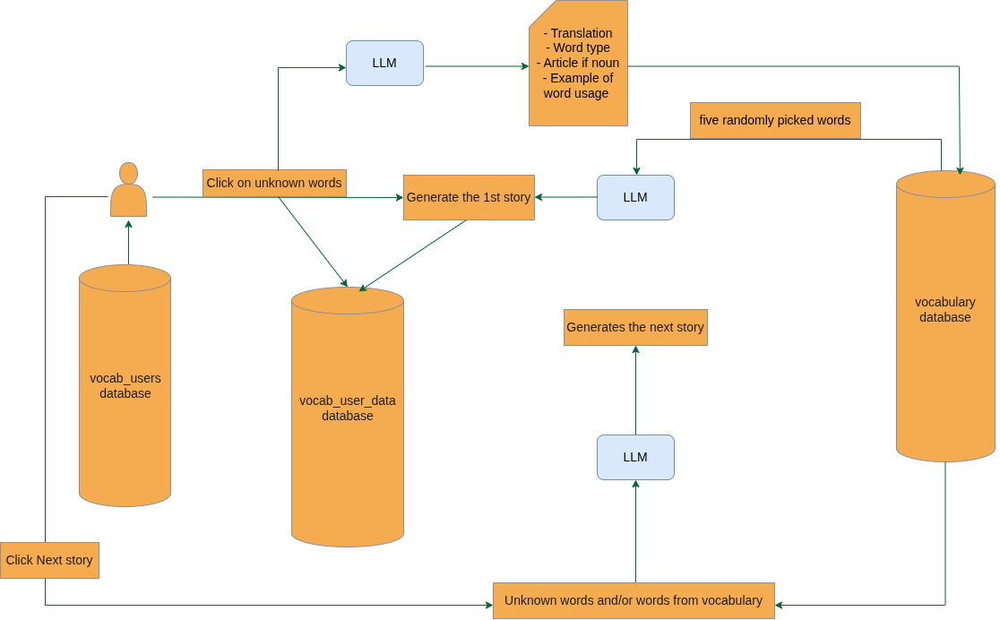

# Prüfungstemplate für Introduction into Web Development

- [Anmeldedaten](#anmeldedaten)
- [Abstract](#abstract)
- [Überblick über den Funktionsumfang](#überblick-über-den-funktionsumfang)
- [Architektur](#architektur)
- [Frontend](#frontend)
- [Ansichten und Interaktionsmöglichkeiten](#ansichten-und-interaktionsmöglichkeiten)
- [Technische Umsetzung](#technische-umsetzung)
- [Besondere Herausforderungen](#besondere-herausforderungen)
- [Backend](#backend)
- [Kommunikationsschnittstellen und APIs](#kommunikationsschnittstellen-und-apis)
- [Authentifizierung und Autorisierung](#authentifizierung-und-autorisierung)
- [Datenbank](#datenbank)
- [Barrierefreiheit](#barrierefreiheit)
- [Datenschutz](#datenschutz)

## Anmeldedaten

Titel: KI-generierte Geschichtern zum Sprache Lernen 
Matrikelnummer: 29749085 
URL vom Deployment:  
Schätzung zur Gesamtentwicklungszeit in Stunden: 3 Woche in Vollzeit (~ 210 Stunden)  
Gitlab-Repo-URL: [Projekt](https://gitlab.gwdg.de/webdev/2026/ki-generierte-geschichten-zum-sprache-lernen.git) 

## Abstract

Die KI-Sprachlern-App (AILLA) ist ein Tool, das das Sprachenlernen durch kurze, von der KI generierte Geschichten in der jeweiligen Zielsprache unterstützt. Derzeit steht Deutsch als Zielsprache zum Lernen zur Verfügung. Zu Beginn wird aus fünf zufällig ausgewählten Wörtern aus der Vokabeldatenbank eine Geschichte generiert. Jedes Wort der Geschichte ist anklickbar und wird durch eine englische Übersetzung, die Wortart (Substantiv, Verb usw.), den Artikel (falls es sich um ein Substantiv handelt) sowie einen Beispielsatz zur Veranschaulichung der Wortverwendung ergänzt.

Die linguistischen Informationen zum Vokabel werden in einem Pop-up-Fenster angezeigt, sobald das Wort angeklickt wird. Die vom Nutzer ausgewählten Wörter kennzeichnen, dass deren Bedeutung unbekannt ist, und werden daher hervorgehoben, um in der nächsten generierten Geschichte wiederverwendet zu werden. Dies hilft dem Nutzer, die ihm unbekannten Wörter in einem neuen, einfachen Kontext wiederzufinden, um seine Sprachkenntnisse zu verbessern. Zusätzlich zu den ausgewählten Wörtern werden zufällig aus der Datenbank ausgewählte Vokabeln in die neue Geschichte eingebunden (sofern die Anzahl der ausgewählten Wörter weniger als fünf beträgt), um die Entwicklung neuer Ideen im Kontext der Geschichte zu fördern.

Jede weitere Geschichte wird automatisch in der Datenbank des Nutzers (die mit seinem Konto verknüpft ist) gespeichert, und auch die aktuelle Geschichte mit den ausgewählten Wörtern kann vom Nutzer gespeichert werden. Der Nutzer kann die aktuell angezeigte Geschichte mit den ausgewählten Wörtern durch Klicken auf die Schaltfläche `Zurücksetzen` entfernen und eine neue Geschichte aus zufällig ausgewählten Wörtern aus der Datenbank generieren.

## Überblick über den Funktionsumfang

- Es sind drei Pocketbase-Sammlungen erforderlich. Eine wird von allen Benutzern gemeinsam genutzt und dient im Wesentlichen zur Speicherung der Vokabularen, aus denen maximal fünf Wörter nach dem Zufallsprinzip ausgewählt werden, um die Geschichten zu erstellen; die zweite dient zur Speicherung der Anmeldedaten des jeweiligen Benutzers und die dritte zur Speicherung der Benutzerdaten, die durch die Interaktion mit dem Dashboard entstehen.

- Auf jede Sammlung werden maßgeschneiderte API-Regeln angewendet, um Sicherheit und Datenintegrität zu gewährleisten.

- Implementierung eines SMTP-Servers in Pocketbase für die Kommunikation. Die SMTP-Anmeldedaten werden von `Brevo` übernommen.

- Der Nutzer erstellt ein Konto mit E-Mail-Adresse, Passwort und Passwortbestätigung. Um sich registrieren zu können, muss der Nutzer der Datenschutzerklärung zustimmen. Anschließend erhält der Nutzer eine E-Mail (verwaltet von Pocketbase) zur Verifizierung seines Kontos.

- Wenn sich der Nutzer anmeldet, wird sein Sitzungstoken für einen Tag in den Browser-Cookies gespeichert und gelöscht, sobald er sich von der Website abmeldet.

- Die Anmeldedaten können im Browser gespeichert werden (nach Wahl des Nutzers) und werden bei zukünftigen Anmeldungen automatisch ausgefüllt.

- Der Nutzer kann sein Anmeldekennwort zurücksetzen. Dazu erhält er eine E-Mail, in der er das neue Kennwort eingeben muss, das anschließend in der Nutzerdatenbank gespeichert wird.

- Auf der Website hat der Nutzer die Möglichkeit, sein Konto samt aller zugehörigen Daten zu löschen. Danach wird der Nutzer auf die Startseite der Website weitergeleitet.

- Im Backend wird Hono für die verschiedenen API-Abfragen verwendet, und das LLM wird zu zwei Zwecken abgefragt:
  1. Es nimmt die ausgewählten Wörter und generiert daraus eine Geschichte.
  2. Es generiert sprachliche Informationen zum angeklickten Wort in einem Popup-Fenster.

- Jedes angeklickte Wort wird mit einer unverwechselbaren Farbe hervorgehoben.

- Wenn auf die Schaltfläche `Nächste Geschichte` geklickt wird, wird die aktuell angezeigte Geschichte automatisch mit den ausgewählten Wörtern in der Datenbank des Nutzers gespeichert. Der Nutzer kann die aktuelle Geschichte auch speichern, ohne eine neue zu generieren, indem er auf die Schaltfläche „Speichern“ klickt. Die Schaltfläche `Zurücksetzen` löscht das Dashboard, sodass der Nutzer eine neue Geschichte aus fünf zufällig ausgewählten Wörtern aus der „Vokabular“-Datenbank generieren kann.

- Mausereignisse werden ausgelöst, um das Burger-Menü in der Navigationsleiste oder das Popup-Fenster des ausgewählten Wortes zu schließen. Auch die Navigation über die Tastatur wird unterstützt.

- Authentifizierung über CORS-Middleware in Hono.

- Die Website bietet zwei Farbmodi und zwei Sprachen, um den Komfort für den Nutzer zu gewährleisten.

- Im Frontend kommt `SvelteKit` zum Einsatz, das eine hohe Performance bietet und flexibles Seitenwechseln sowie schnelles Rendern ermöglicht.

- Die Seiten `Datenschutz`, `Impressum` und `Barrierefreiheit` befinden sich in der Fußzeile und werden in beiden Sprachen angeboten.

- Anpassbarkeit des Designs an den mobilen Modus bis zu einer Breite von 300 px.

## Architektur

**Software stack:** Pocketbase-Datenbank, Hono für REST-API-Anfragen und Bruno zum API Testen, Open-Weights-LLM, Svelte für das Frontend; Autorisierung durch Kontoerstellung und Authentifizierung, gesteuert durch das Hono-Backend und die Pocketbase-API-Regeln

Die Architektur der Anwendung ist unten dargestellt.

    <picture>
        
    </picture>

F: Welche Entscheidungen mit projektweiten Auswirkungen wurden im Design und Entwicklungsprozess getroffen? Wie und warum wurde so entschieden?

- Im Rahmen des Entwicklungsprozesses wurde beschlossen, die sprachlichen Informationen zum ausgewählten Wort zu erweitern und statt der reinen Wortübersetzung eine detaillierte Lernkarte mit Angaben zu Wortart, Artikel und Beispielillustration hinzuzufügen. Dies bietet mehr Lernmöglichkeiten.

- Die Lernkarte wird in der Vokabeldatenbank gespeichert, sodass sie abgerufen werden kann, anstatt sie erneut vom LLM generieren zu müssen, was Rendering-Zeit und Rechenleistung spart.

- Setzen von Cookies zum Speichern des Anmeldetokens, damit der Benutzer nicht ohne authentifizierte Anmeldung direkt zum Dashboard weitergeleitet wird.

- Speichern der Sprach- und Modus-Einstellungen des Benutzers im lokalen Speicher des Browsers, damit diese bei einer Seitenaktualisierung oder bei zukünftigen Anmeldungen erhalten bleiben.

F: Warum sind der Softwarestack und die verwendete Architektur eine geeignete Wahl?

- **Pocketbase:** Es bietet eine eingebettete Datenbank, Benutzerauthentifizierung, Dateispeicherung und ein benutzerfreundliches Dashboard. Außerdem verwaltet es die Kommunikation mit dem Benutzer während der Registrierung und Anmeldung durch E-Mail-Verifizierung sowie die Passwortzurücksetzung mithilfe ansprechender Vorlagen. Dadurch war es einfach, die Daten während der Entwicklung zu überprüfen und zu verwalten.

- **Hono:** Es wurde für die Backend-API ausgewählt, da es leichtgewichtig und schnell ist und gut mit TypeScript zusammenarbeitet. Es ermöglicht die Erstellung übersichtlicher API-Routen für alle Aufgaben sowie die Kommunikation mit Pocketbase. Hono stellt zudem Middleware für Funktionen wie CORS, Cookies und die Authentifizierungsverwaltung bereit.

- **Bruno:** Damit lassen sich API-Abfragen an das Backend ganz einfach testen. Über das Dashboard kann man das Ergebnis direkt einsehen, was die Fehlerbehebung erheblich erleichtert.

- **SvelteKit:** Es unterstützt reaktive Benutzeroberflächen und komponentenbasierte Entwicklung. Die Oberfläche reagiert sofort, wenn ein Nutzer die Sprache wechselt, ein Wort auswählt usw. SvelteKit bietet zudem Routing, Layouts, serverseitige Funktionen und Zustandsverwaltung, was bei der Organisation der Webseiten hilft.

- Dieser Software-Stack ist relativ leichtgewichtig, leistungsstark und lässt sich nahtlos und problemlos für Server, Datenbanken oder Frameworks konfigurieren.

## Frontend

F: Wie ist das Frontend strukturiert?

- Die Struktur basiert auf einem Komponenten-Routing. Die Hauptseiten sind die Startseite, die Registrierungsseite, die Anmeldeseite und das Dashboard. Der Nutzer gelangt erst dann zum Dashboard, wenn bestätigt wurde, dass er authentifiziert und verifiziert ist.

- Wenn der Nutzer versucht, ohne gültiges Sitzungstoken auf das Dashboard zuzugreifen, wird er auf die Anmeldeseite weitergeleitet; ebenso wird er auf die Startseite der Website weitergeleitet, wenn er sich vom Dashboard abmeldet oder sein Konto löscht.

- Die Seiten in der Fußzeile werden über Hyperlinks aufgerufen und in derselben Sprache und demselben Farbmodus geöffnet, die bzw. der im Dashboard ausgewählt wurde.

- In der Navigationsleiste wird rechts die registrierte E-Mail-Adresse mit einem Dropdown-Menü angezeigt, während links das Logo der Website zu sehen ist. Das Logo ist ein Link, der den Nutzer zur Landingpage weiterleitet.

F: Welche Aufgaben und Verantwortlichkeiten werden im Frontendbereich umgesetzt?

- Registration, user authentication, account management (password, reset, delete), generate stories with learning cards, save the learning progress, enhancing the user experience through color mode, language choice, keyboard and mouse control.

## Ansichten und Interaktionsmöglichkeiten

F: Welche Ansichten (Views) beinhaltet die Anwendung?

- Die Anwendung umfasst mehrere Ansichten, die den gesamten Nutzerpfad von der Kontoerstellung bis hin zu den Sprachlernaktivitäten unterstützen.

- Über die **Registrierungsansicht** können neue Nutzer ein Konto erstellen. Hier werden die erforderlichen Nutzerdaten erfasst und an das Backend gesendet, wo das Konto über PocketBase gespeichert und verwaltet wird.

- Die **Anmeldeansicht** ermöglicht es registrierten Nutzern, sich anzumelden. Nach erfolgreicher Anmeldung wird der Nutzer zum geschützten Dashboard weitergeleitet. Sie umfasst außerdem Funktionen wie das Zurücksetzen des Passworts und das erneute Versenden der Bestätigungs-E-Mail.

- Die **Dashboard-Ansicht** ist der Hauptbereich der Anwendung. Von dieser Ansicht aus kann der Nutzer den Lernprozess starten, eine kurze KI-basierte Geschichte generieren, die Geschichte lesen und mit einzelnen Wörtern interagieren.

- Die **Geschichten-Lernansicht** zeigt die generierte Geschichte an. Nutzer können auf unbekannte Wörter klicken, um deren Übersetzungen anzuzeigen. Die ausgewählten Wörter werden gespeichert und von der Anwendung verwendet, um Vokabeln zu identifizieren, die der Lernende üben sollte.

- Die **Vokabelansicht** zeigt die Wörter an, die der Nutzer ausgewählt hat oder noch nicht kennt. Diese Wörter können gespeichert, wiederholt und bei der Generierung zukünftiger Geschichten verwendet werden, sodass sich die Lerninhalte an den Fortschritt des Nutzers anpassen.

- Die Anwendung enthält außerdem eine **Navigationsleiste**, die Zugriff auf die Hauptseiten bietet und Steuerelemente zum Ändern der Sprache der Benutzeroberfläche sowie zum Wechseln zwischen hellem und dunklem Design enthält.

- Zusätzliche Informationsansichten, wie beispielsweise das **Impressum** und andere rechtliche oder informative Seiten, sind sowohl auf Englisch als auch auf Deutsch verfügbar.

F: Wie können Nutzende mit der Anwendung interagieren?

- Schaltflächen, Navigationslinks, Formulare, anklickbare Wörter innerhalb des Textes, Navigation und Steuerung über die Tastatur.

## Technische Umsetzung

F: Wie wird HTML erzeugt? Welche Frameworks/Bibliotheken wurden dafür genutzt? Warum?

- Der HTML-Code der Anwendung wird mithilfe von `SvelteKit` generiert, das auf dem Svelte-Framework basiert. Anstatt statische HTML-Seiten zu schreiben, besteht die Anwendung aus wiederverwendbaren Svelte-Komponenten. Jede Komponente enthält HTML, CSS und TypeScript/JavaScript in einer einzigen Datei, wodurch sich der Code einfacher organisieren und warten lässt.

- `Svelte` kompiliert diese Komponenten während des Build-Prozesses zu effizientem JavaScript. Während der Ausführung der Anwendung wird der generierte HTML-Code automatisch aktualisiert, sobald sich die zugrunde liegenden Daten ändern. Dieser reaktive Ansatz macht eine manuelle Bearbeitung des DOM überflüssig und führt zu einer besseren Performance sowie zu übersichtlicheren Code.

- `SvelteKit` erweitert Svelte um Funktionen wie dateibasiertes Routing, Layouts, serverseitiges Rendering (SSR), clientseitige Navigation und Datenladung. Diese Funktionen vereinfachen die Entwicklung mehrseitiger Anwendungen und verbessern sowohl die Benutzererfahrung als auch die Suchmaschinenoptimierung.

F: Wie wurden die Ansichten ausgestaltet (Webdesign, Styling)? Welche Frameworks/Bibliotheken wurden dafür genutzt? Warum?

- Die Anwendung nutzt das `Bulma-CSS-Framework`, um das visuelle Layout und die Gestaltung der HTML-Elemente zu generieren. Bulma stellt responsive Komponenten wie Navigationsleisten, Schaltflächen, Formulare und Container bereit, wodurch sich die Benutzeroberfläche an unterschiedliche Bildschirmgrößen anpassen lässt und gleichzeitig der Aufwand für das Schreiben von benutzerdefiniertem CSS reduziert wird.

## Besondere Herausforderungen

F: Welche besonderen Herausforderungen fürs Frontend haben sich bereit aus der Projektidee ergeben?

- **Interaktiven Story-Oberfläche:** die Nutzer müssen in der Lage sein, einzelne Wörter innerhalb einer KI-generierten Geschichte anzuklicken, um deren Übersetzungen anzuzeigen. Die Oberfläche musste daher das ausgewählte Wort erkennen, mit dem Backend kommunizieren, um dessen Übersetzung abzurufen, und die Anzeige aktualisieren, ohne die Seite neu zu laden.

- **Reaktive Zustandsverwaltung:** die Anwendung muss den Überblick über die aktuelle Geschichte, die ausgewählten Wörter, den Lernfortschritt des Nutzers, den Authentifizierungsstatus, die Sprachauswahl und die Themenpräferenz behalten. Diese Zustände müssen über verschiedene Komponenten hinweg synchronisiert bleiben und gegebenenfalls persistent gespeichert werden.

- **Dynamische Darstellung von Inhalten:** da die Geschichten von einem KI-Modell generiert werden, kann sich das Frontend nicht auf vordefinierten Text stützen. Stattdessen muss es neu generierte Inhalte zur Laufzeit darstellen und dabei das interaktive Verhalten jedes einzelnen Wortes beibehalten.

- **mehrsprachigen Unterstützung:** die Benutzeroberfläche ist sowohl auf Englisch als auch auf Deutsch verfügbar, was eine dynamische Sprachumschaltung erfordert, bei der sichergestellt ist, dass alle Oberflächenelemente konsistent aktualisiert werden.

- **Responsive Design:** die Anwendung musste auf Desktop-Computern, Tablets und Smartphones eine einheitliche Benutzererfahrung bieten. Dies erforderte responsive Layouts, Navigationsmenüs und Inhalte, die sich an unterschiedliche Bildschirmgrößen anpassen.

- **Benutzerauthentifizierung:** geschützte Seiten wie das Dashboard erst nach erfolgreicher Anmeldung zugänglich sein dürfen. Das Frontend musste daher den Authentifizierungsstatus, den Routenschutz und die Benutzersitzungen verwalten.

F: Welche unerwarten Herausforderungen sind bei der Umsetzung aufgetreten (z.B. unerwartet aufwändige Aspekte, Hürden, Komplikationen)?

- **Integration der verschiedenen Technologien:** die Anwendung kombiniert SvelteKit für das Frontend, Hono für das Backend, PocketBase für die Datenspeicherung und Authentifizierung sowie KI-Dienste für die Generierung von Geschichten. Um eine zuverlässige Kommunikation zwischen diesen Komponenten zu gewährleisten, waren eine sorgfältige API-Konzeption, Fehlerbehebung und Tests erforderlich.

- **Benutzerauthentifizierung und das Sitzungsmanagement:** die Implementierung von sicherer Anmeldung, Registrierung, E-Mail-Verifizierung, Passwortzurücksetzung, geschützten Routen und Sitzungsverwaltung erwies sich als komplexer als ursprünglich erwartet. Die Verwaltung von Cookies, Authentifizierungstoken und Routenschutz bei gleichzeitiger Gewährleistung einer reibungslosen Benutzererfahrung erforderte erheblichen Entwicklungsaufwand.

- **Responsive Benutzeroberfläche:** erforderte mehr Aufwand als erwartet. Komponenten wie die Navigationsleiste, Dropdown-Menüs und das Layout der Artikel mussten sowohl auf Desktop-Computern als auch auf Mobilgeräten einwandfrei funktionieren. Einige Funktionen mussten für kleinere Bildschirme anders umgesetzt werden, um eine einheitliche Benutzererfahrung zu gewährleisten.

- **Aufrechterhaltung des Anwendungszustands:** Benutzereinstellungen wie die ausgewählte Sprache und das helle oder dunkle Design mussten auch beim Neuladen von Seiten beibehalten werden, ohne dass es zu visuellen Unstimmigkeiten wie flackernden Designs oder verzögerten Sprachaktualisierungen kam. Es war zusätzliche Logik erforderlich, um diese Einstellungen vor der Darstellung der Benutzeroberfläche korrekt zu initialisieren.

## Backend

F: Wie ist das Backend strukturiert? Welche Teilkomponenten hat es? Wie stehen sie in Beziehung zueinander?

- **Hono-API-Server:** der als Kommunikationsschicht zwischen dem Frontend und den Backend-Diensten fungiert. Alle Anfragen vom SvelteKit-Frontend werden über REST-API-Endpunkte an den Hono-Server gesendet. Der Server validiert die Anfragen, führt die erforderliche Geschäftslogik aus und gibt die entsprechenden Antworten zurück.

F: Welche Aufgaben und Verantwortlichkeiten werden im Backendbereich umgesetzt?

- **API-Schicht (Hono):** Stellt REST-Endpunkte für die Benutzerregistrierung, die Anmeldung, das Zurücksetzen des Passworts, die E-Mail-Verifizierung, die Generierung von Geschichten, den Abruf von Vokabeln, Übersetzungsanfragen und andere Anwendungsfunktionen bereit. Sie ist für die Verarbeitung eingehender HTTP-Anfragen und die Koordination der anderen Backend-Komponenten zuständig.

- **Authentifizierungsmodul (PocketBase):** Verwaltet Benutzerkonten, die Authentifizierung, die Sitzungsverwaltung, die E-Mail-Verifizierung und die Funktion zum Zurücksetzen des Passworts. Es stellt sicher, dass nur authentifizierte Benutzer auf geschützte Ressourcen zugreifen können.

- **Autorisierung:** Schützt eingeschränkte API-Endpunkte und stellt sicher, dass nur authentifizierte Benutzer auf personenbezogene Daten und Anwendungsfunktionen zugreifen können.

- **Datenbankschicht (PocketBase):** Speichert persistente Anwendungsdaten, darunter Benutzerkonten, Vokabeln, generierte Geschichten, Lernfortschritte und andere Anwendungsdaten. Das Backend greift über das PocketBase-JavaScript-SDK auf die Datenbank zu.

- **Geschäftslogik-Schicht:** Enthält die anwendungsspezifische Logik, wie z. B. die Auswahl des Vokabulars für den Lernenden, die Verarbeitung angeklickter Wörter, die Aufbereitung von Daten für die Generierung von Geschichten sowie die Koordination der Interaktionen zwischen Frontend, Datenbank und KI-Diensten.

## Kommunikationsschnittstellen und APIs

F: Welche Kommunikationsschnittstellen zwischen Teilsystemen (z.B. Kommunikation zwischen Frontend/Browser und Backend/Server) gibt es? Wie sehen diese aus?

- REST APIs:
  - GET – Daten abrufen (z. B. Vokabeln oder Übersetzungen)
  - POST – Daten übermitteln (z. B. Anmeldedaten oder Anfragen zur Generierung von Geschichten)
  - PUT/PATCH – Vorhandene Daten aktualisieren (falls erforderlich)
  - DELETE – Gespeicherte Daten löschen (falls erforderlich)

- Das Hono-Backend kommuniziert mit PocketBase über das PocketBase-JavaScript-SDK. Anstatt direkte SQL-Abfragen durchzuführen, führt das Backend CRUD-Operationen über das SDK aus.
  - Zu den typischen Operationen gehören: Benutzerregistrierung und -anmeldung, E-Mail-Verifizierung, Passwort, zurücksetzen, Vokabeln abrufen, Lernfortschritt speichern, Benutzerdaten aktualisieren

F: Falls bestehende/externe APIs verwendet werden: Welche Routen/Endpunkte werden verwendet? Welche Daten werden übertragen und wozu?

- **LLM API:** Das LLM `meta-llama-3.1-8b-instruct` wird von `GWDG` unter dem Endpunkt `https://chat-ai.academiccloud.de/v1` bereitgestellt.

- **SMTP Server:** Konfigurierter SMTP-Server, über den Pocketbase bei der Registrierung oder beim Zurücksetzen des Passworts mit dem Benutzer kommuniziert. Der SMTP-Dienst wird von `Brevo` bereitgestellt.

## Authentifizierung und Autorisierung

F: Gibt es ein Registrierungs- und/oder Anmeldungsystem?

- Ja, bereits in den vorherigen Fragen beschrieben. Siehen Sie in [Ansichten und Interaktionsmöglichkeiten](#ansichten-und-interaktionsmöglichkeiten).

F: Welche Bereiche des Systems sind schützenswert?

- **Benutzerkonten:** Registrierungsdaten, Anmeldedaten und Kontoinformationen müssen geschützt werden, um unbefugten Zugriff zu verhindern. Authentifizierungsmechanismen, der sichere Umgang mit Passwörtern und die E-Mail-Verifizierung tragen dazu bei, dass nur berechtigte Benutzer auf ihre Konten zugreifen können.

- **Authentifizierung und Sitzungen:** Anmeldetoken oder Sitzungs-Cookies müssen sicher verwaltet werden, um Sitzungsentführungen und unbefugten Zugriff auf geschützte Ressourcen zu verhindern.

- **Geschützte API-Endpunkte::** Backend-API-Endpunkte, die Zugriff auf personenbezogene Daten gewähren oder Anwendungsdaten ändern, sollten nur für authentifizierte Benutzer zugänglich sein. Autorisierungsprüfungen stellen sicher, dass Benutzer nur auf ihre eigenen Daten zugreifen oder diese ändern können. Dies wird über das Hono-Backend (Zugriff nur für verifizierte Benutzer, Cookies) und die in Pocketbase für jede Datensammlung festgelegten API-Regeln gesteuert.

- **Kommunikation zwischen Frontend und Backend:** Die gesamte Kommunikation zwischen dem Browser und dem Backend sollte über HTTPS verschlüsselt werden. Dies wird durch die CORS-Middleware von HONO verwaltet.

- **Konfigurationsdaten und geheime Schlüssel:** Sensible Konfigurationsdaten wie API-Schlüssel, Datenbankzugangsdaten und Anwendungsgeheimnisse dürfen niemals im Frontend gespeichert oder in das Quellcode-Repository übernommen werden. Stattdessen werden sie sicher als Umgebungsvariablen auf dem Server gespeichert.

F: Wie wird sichergestellt, dass sich Dritte nicht (unerlaubt) als ein Nutzender ausgeben können (Authentifizierung)?

- **Benutzerauthentifizierung:** Benutzer authentifizieren sich durch Angabe ihrer E-Mail-Adresse und ihres Passworts. Diese Anmeldedaten werden von PocketBase während des Anmeldevorgangs überprüft. Der Zugriff wird nur gewährt, wenn die Anmeldedaten mit einem registrierten Benutzerkonto übereinstimmen.

* **Sichere Speicherung von Passwörtern:** Benutzerpasswörter werden niemals im Klartext gespeichert. PocketBase hasht Passwörter sicher, bevor sie in der Datenbank gespeichert werden. Bei der Anmeldung wird das eingegebene Passwort gehasht und mit dem gespeicherten Hash verglichen, wodurch sichergestellt wird, dass das ursprüngliche Passwort selbst bei einer Kompromittierung der Datenbank nicht wiederhergestellt werden kann.

- **E-Mail-Verifizierun:** Nach der Registrierung müssen Benutzer ihre E-Mail-Adresse verifizieren, indem sie auf einen Verifizierungslink klicken, der an ihre E-Mail-Adresse gesendet wurde. Nur verifizierte Konten dürfen geschützte Funktionen der Anwendung nutzen. Dies verhindert, dass Angreifer Konten unter Verwendung der E-Mail-Adresse einer anderen Person erstellen.

- **Passwortwiederherstellung:** Falls Nutzer ihr Passwort vergessen haben, bietet die Anwendung einen sicheren Vorgang zur Passwortzurücksetzung. Ein Link zur Passwortzurücksetzung wird ausschließlich an die verifizierte E-Mail-Adresse gesendet, die mit dem Konto verknüpft ist, wodurch unbefugte Passwortänderungen verhindert werden.

- **Sitzungsverwaltung:** Nach einer erfolgreichen Anmeldung vergibt PocketBase ein Authentifizierungstoken. Das Backend verwendet dieses Token, um den authentifizierten Nutzer bei nachfolgenden Anfragen zu identifizieren. Das Token wird sicher gespeichert (beispielsweise in einem HTTP-only-Cookie), sodass der Server die Identität des Nutzers überprüfen kann, ohne dass sich dieser bei jeder Anfrage erneut anmelden muss.

- **Geschützte API-Endpunkte:** Sensible Backend-Endpunkte sind durch Authentifizierungsprüfungen geschützt. Vor der Bearbeitung einer Anfrage überprüft das Backend, ob der Benutzer authentifiziert ist. Wenn die Authentifizierung fehlschlägt oder keine gültige Sitzung vorliegt, wird die Anfrage mit einem entsprechenden HTTP-Statuscode (z. B. 401 Unauthorized) abgelehnt.

- **Konto-Löschen:** Im Frontend dürfen nur angemeldete (über das Login-Token in den Cookies überprüft) und verifizierte Benutzer ihre eigenen Konten löschen.

F: Wie wird sichergestellt, dass nur erlaubte bzw. autorisierte Zugriffe zugelassen werden (Autorisierung)?

- Die Authentifizierung bestätigt, wer der Nutzer ist, während die Autorisierung festlegt, auf welche Inhalte der Nutzer zugreifen darf. Das Backend stellt sicher, dass Nutzer nur auf ihre eigenen Lerndaten, Vokabeln und Kontoinformationen zugreifen oder diese ändern können. Anfragen, die versuchen, auf die Daten eines anderen Nutzers zuzugreifen, werden abgelehnt.

- **Benutzerspezifischer Datenzugriff:** Die Lerndaten jedes Benutzers, wie beispielsweise erstellte Geschichten, ausgewählte Vokabeln und Lernfortschritte, sind mit der eindeutigen Kennung dieses Benutzers verknüpft. Wenn das Backend eine Anfrage verarbeitet, verwendet es die ID des authentifizierten Benutzers, um ausschließlich die entsprechenden Datensätze abzurufen oder zu ändern. Dadurch können Benutzer nicht auf die persönlichen Daten anderer Benutzer zugreifen. Das Gleiche gilt, wenn ein Benutzer sein Konto löscht: Auch alle zugehörigen Daten (Geschichten, ausgewählte Wörter usw.) werden gelöscht.

- **Zugriffsregeln für PocketBase::** Die Autorisierung wird zusätzlich durch die Sammlungsregeln von PocketBase durchgesetzt. Zugriffsregeln legen fest, welche authentifizierten Benutzer Datensätze erstellen, lesen, aktualisieren oder löschen dürfen. Beispielsweise darf ein Benutzer nur Datensätze lesen oder ändern, bei denen die gespeicherte Benutzer-ID mit seiner authentifizierten Benutzer-ID übereinstimmt.

- **Serverseitige Autorisierungsprüfungen:** Autorisierungsentscheidungen werden im Backend und nicht im Frontend getroffen. Selbst wenn jemand den clientseitigen Code verändert oder HTTP-Anfragen manuell sendet, überprüft das Backend dennoch die Berechtigungen des Benutzers, bevor eine Operation ausgeführt wird. Dies verhindert unbefugten Zugriff durch manipulierte Anfragen.

- **Sitzungsvalidierung:** Jede Anfrage an eine geschützte Ressource enthält die authentifizierte Sitzung des Benutzers. Das Backend validiert die Sitzung, bevor es einen Vorgang ausführt. Ist die Sitzung abgelaufen oder ungültig, wird der Zugriff verweigert und der Benutzer muss sich erneut authentifizieren.

- **Administratorzugriff:** Administrative Funktionen, wie beispielsweise die Verwaltung von Datenbanksammlungen oder Benutzerkonten über die PocketBase-Verwaltungsoberfläche, sind auf Administratorkonten beschränkt. Normale Benutzer können weder auf diese Funktionen zugreifen noch administrative Vorgänge ausführen. Selbst wenn ein Benutzer Zugriff auf PocketBase hat, kann er die Felder nicht ändern, deren Bearbeitung ausschließlich Superusern vorbehalten ist, wie beispielsweise das Anlegen oder Aktualisieren eines Datensatzes in der Sammlung `vocab_user_data`.

## Datenbank

F: Was wird als Datenbanklösung verwendet?

- Pocketbase, Siehen Sie in [Architektur](#architektur)

F: Welche Daten beinhaltet die Datenbank und wie sind sie strukturiert?

- Die Schemata der Sammlungen finden Sie [hier](./data/pb_collections) sowie im Abschnitt [Datenbank](./README.md#database) der README.md-Datei.

## Barrierefreiheit

[Mehr Info hier](./frontend/src/routes/de/accessibility/+page.svelte)

F: In welchem Umfang ist die WebApp barrierefrei nutzbar?

- Die Website entspricht teilweise der EU-Richtlinie 2016/2102. Es gibt jedoch noch einige Bereiche, die die Anforderungen der EU-Richtlinie 2016/2102 nicht erfüllen. Folgende Barrierefreiheitsfunktionen stehen zur Verfügung:

- Hoher Farbkontrast für alle Funktionen der Website mit ausreichenden
  Abständen zwischen den Elementen.
- Es stehen zwei Designs zur Verfügung (hell und dunkel).
- Alle Seiten werden in zwei Sprachen (Englisch und Deutsch) unterstützt.
- Tastaturnavigation zwischen allen Funktionen mit der Möglichkeit, eine
  Funktion auszuwählen (Enter-Taste) oder ein Burger-Menü zu schließen (Esc-Taste oder Leertaste). Alle
  Funktionen sind über einen kurzen Pfad erreichbar und werden hervorgehoben, wenn sie im Fokus stehen.
- Mausereignisse werden unterstützt, wobei ein Menü durch
  einen Mausklick außerhalb des Menüs geschlossen werden kann und automatisch geschlossen wird, sobald der
  Nutzer auf ein anderes Element auf der Seite klickt.
- Anmeldedaten können im Browser gespeichert werden (nach Wahl des Nutzers) und
  werden dann bei zukünftigen Anmeldungen automatisch ausgefüllt.
- Bei jeder Aktion werden dem Nutzer Informationsmeldungen angezeigt, die
  nach einer bestimmten Zeit (~ 5
  Sekunden) automatisch verschwinden.
- Anpassung der Website an den mobilen Modus (kleine Bildschirme bis zu
  300px).

Folgende Elemente sind nicht barrierefrei:

- Easy und Gebärdensprache werden nicht unterstützt.
- Die Größe des Website-Symbols im Browser ist klein und wird
  vom Browser gesteuert.

F: Welche Standards wurden berücksichtigt?

- EU-Richtlinie 2016/2102, das Gesetz gegen die Diskriminierung von Menschen mit Behinderungen (BGG) und die Richtlinien für barrierefreie Webinhalte (WCAG) im Rahmen einer Selbstbewertung.

F: Wie wurde die barrierefreiheit getestet?

- Durch die Navigation mit der Tastatur im Dashboard und das Öffnen von Elementen durch Drücken der `Enter`-Taste oder das Schließen durch Drücken der `ESC`- oder `Leertaste`. Außerdem werden Mausklicks ausgelöst, um die Popup-Fenster der Lernkarte oder das Burger-Menü in der Navigationsleiste zu schließen.

## Datenschutz

[Mehr Info hier](./frontend/src/routes/de/data-privacy/+page.svelte)

F: Wie wurde privacy by design bei Architektur und Design des Systems berücksichtigt?

- **Datenminimierung und Zweckbindung:** Es werden nur die für den Betrieb des Dienstes erforderlichen Daten verarbeitet, und die Verarbeitung erfolgt ausschließlich mit Einwilligung des Nutzers (Art. 6 Abs. 1 Buchstabe a DSGVO).

- **Getrennte Architektur mit kontrollierten Datenflüssen:** Die App ist in Frontend, Backend und ein extern gehostetes LLM (SAIA/GWDG) unterteilt, und es werden nur ausgewählte Wörter an den LLM-Anbieter weitergegeben, nicht jedoch alle Nutzerdaten.

- **Kontrollierter Speicherort:** Registrierungs- und Nutzerdaten werden auf einem selbst gehosteten PocketBase-Server zur Konto- und Datenverwaltung gespeichert.

- **Zugriffsbeschränkung:** Auf die gespeicherten Datenbankdaten haben laut Beschreibung nur der Nutzer und der Website-Anbieter Zugriff.

- **Begrenzte Weitergabe an Dritte:** Der Anbieter gibt an, dass er keine personenbezogenen Daten an Dritte weitergibt, mit Ausnahme ausgewählter Wörter, die zur Nutzung der LLM-Funktionalität an die GWDG gesendet werden.

- **Transparenz bezüglich Dritter und Verantwortlichkeiten:** Die Nutzer werden für Informationen zu Dritten auf die Datenschutzerklärung der GWDG und das Impressum des Projekts verwiesen.

- **In die Richtlinie/den Prozess integrierte Kontrollrechte der Nutzer:** Rechte auf Auskunft, Löschung, Widerspruch und Widerruf der Einwilligung, einschließlich Kontaktmöglichkeiten sowohl für den Website-Anbieter als auch für die GWDG, sofern relevant.

F: Welche personenbezogenen Daten werden verarbeitet/gespeichert?

- E-Mail-Adresse, Passwort, vom Nutzer ausgewählte Wörter und die daraus generierte Geschichte.

F: Werden besondere Kategorien personenbezogener Daten verarbeitet?
Nein

F: Welche Betroffenenrechte (Auskunft, Löschung, Änderung, Widerspruch, usw.) können automatisiert und selbstständig unmittelbar über die Webanwendung wahrgenommen werden? Welche benötigen manuelle Schritte, z.B. durch einen Administrator?

- Kann vom Benutzer im Frontend verwaltet werden:
  - Abmelden und damit Löschen des Sitzungstokens aus den Cookies.
  - Löschen des Kontos und aller dazugehörigen Daten.
  - Schreiben in die `vocab_user_data` seines Kontos (ausgewählte Wörter, Geschichte).
  - Anlegen und Aktualisieren von Datensätzen in der Sammlung `vocabulary`, die von allen Benutzern gemeinsam genutzt wird.

- Kann vom Benutzer in der Pocketbase verwaltet werden:
  - Der Benutzer hat das Recht, seine Daten in der Pocketbase gemäß den für jede Sammlung festgelegten API-Regeln zu verwalten. Einige Zugriffs- und Änderungsrechte können jedoch nur vom Administrator verwaltet werden. Siehen Sie den [Abschnitt Details](./README.md#pocketbase-collections).
